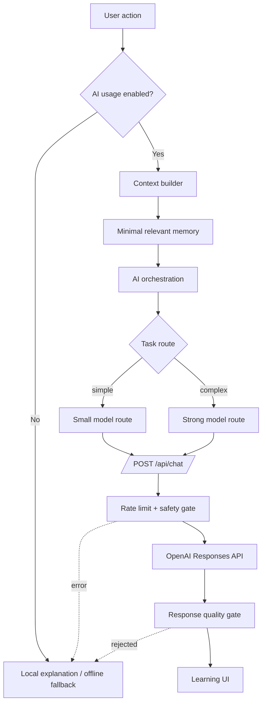

# AI architecture

## 1. Role of AI

AI is an optional support layer for explanation, correction, practice drafting and recommendations. It does not replace curriculum records, human content approval, measured progress or official TOPIK assessment.

User-facing name: **Trợ lý học tập**. Technical modules may retain AI-specific names where required for routing, telemetry and privacy disclosure.

## 2. Request flow

## 3. Client responsibilities

Key services are distributed across `app.js`, `data/ai-infrastructure.js`, `data/learning-memory.js`, `data/ai-agent-architecture.js` and related modules.

The client:

- Checks `PrivacyPreferenceService.allows('aiUsage')`.
- Selects a bounded task type and prompt version.
- Builds learner context from current level, goals, weak skills, recent errors, due SRS, current lesson and a limited memory retrieval.
- Sends only recent conversation messages.
- Records bounded usage/evaluation metadata where enabled.
- Returns local or deterministic fallback when AI/network/configuration is unavailable.

The client must not send password, auth token, raw database or unbounded history as learner context.

## 4. Server responsibilities

`api/chat.js`:

- Accepts POST only.
- Requires explicit AI consent in header and JSON body.
- Applies per-instance IP rate limiting.
- Normalizes message roles and truncates input.
- Compacts learner context by depth, entry count and string length.
- Rejects common secret/password/token patterns.
- Builds a system instruction with task, language, level-safety constraints and minimal context.
- Routes to configured small/strong model environment variables.
- Calls `https://api.openai.com/v1/responses` with `store: false`.
- Rejects empty or secret-like output and returns controlled errors.

Realtime voice feedback additionally asks for strict JSON schema output. Local acoustic/text analysis remains separate and must not be represented as model-based phoneme scoring.

## 5. Context limitation

Current hard limits at the API boundary:

| Item | Limit |
|---|---|
| Recent messages | 12 |
| Message content | 4,000 characters |
| Context JSON | 9,000 characters |
| Context depth | 3 nested levels |
| Array items | 10 |
| Object entries | 20 |
| Default output | 900 tokens |
| Realtime voice feedback output | 320 tokens |

Client retrieval is narrower where possible, for example top weak skills/errors and up to six relevant memory/knowledge nodes.

## 6. Personal memory

`LearningMemoryService` stores selected learning preferences, goals, repeated mistakes and weak/strong knowledge. It does not treat complete chat history as long-term memory. Memory is user-scoped and included in CloudSync only through the existing bounded learning snapshot.

Requirements for any new memory field:

- Learning purpose is explicit.
- User can disable AI usage.
- Do not store credentials, raw audio or unnecessary personal text.
- Include confidence/evidence; do not convert model guesses into learner facts.

## 7. Safety and quality

Current gates cover:

- task/model allowlists;
- secret-like pattern rejection;
- response presence/length;
- prompt instructions against invented grammar, official scores and unsupported model claims;
- structured schema for selected tasks;
- optional quality/audit metadata.

Limitations:

- The server does not run a native-speaker or formal grammar validator on every answer.
- Prompt instructions reduce but do not eliminate hallucination.
- “Quality score” in supporting modules is not independent proof of linguistic correctness.
- Human-reviewed content remains the preferred source for curriculum and examples.

## 8. Privacy

- AI is opt-in/controllable through Privacy Center.
- The API key is server-side only.
- Provider requests set `store: false`.
- Passwords, tokens and authentication state must not enter prompts.
- Conversation/memory data remains scoped to the learner in local/cloud domains.
- Review provider terms and regional data requirements before production launch.

## 9. Error handling and fallback

| Failure | Behavior |
|---|---|
| AI disabled | Explain preference state and link to settings. |
| No API key | Return configured false/503; core learning continues. |
| Offline/timeout | Show connection state; dictionary, lessons and offline practice remain available. |
| Provider error | Controlled 502; do not fabricate response. |
| Invalid/rejected output | Discard output and use fallback/error copy. |

## 10. Cost control

- Task-based small/strong routing.
- Bounded input/output and recent messages.
- Usage token fields returned by server.
- Request counters/telemetry in AI infrastructure.
- No background AI call should run without an explicit learning purpose.

Before monetized production use, add authenticated quotas, distributed rate limiting, budget alerts and provider-level dashboards.
