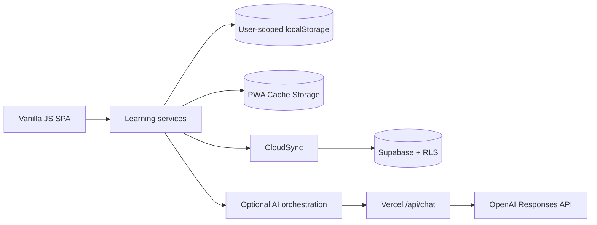

# Case study: Tiếng Hàn - TamHoanq

## 1. Background

TamHoanq bắt đầu như một mobile-first web app cho người Việt học tiếng Hàn. Qua nhiều phase, sản phẩm tích lũy beginner content, TOPIK, SRS, practice, speaking, AI assistance, analytics, offline and platform foundations.

Vấn đề sản phẩm chuyển từ “thiếu tính năng” sang “làm sao giữ một hành trình rõ ràng, dữ liệu an toàn và kiến trúc có thể kiểm chứng khi số module tăng”.

## 2. Challenge

### Product challenge

- Phục vụ người chưa biết Hangul mà không làm mất công cụ cho người học TOPIK.
- Giảm quá tải feature và giữ một next action rõ trên Home.
- Dùng AI như trợ giúp, không biến sản phẩm thành chatbot hoặc nguồn curriculum không kiểm soát.

### Technical challenge

- Ứng dụng static không có framework/state library nhưng có nhiều route/module.
- Học phải tiếp tục khi cloud hoặc AI chưa cấu hình.
- localStorage data đã tồn tại phải được mở rộng mà không reset.
- Cloud sync cần tránh last-write-wins im lặng và mutation lặp.
- PWA cache phải cân bằng offline với khả năng nhận bản deploy mới.
- Bảng/migration nền tảng phải có RLS và không làm client role trở thành quyền thật.

## 3. Solution

### Local-first learning core

Progress, SRS, profile and errors write locally first. Each domain is scoped to a learner ID. Additive schema normalization keeps old values and fills missing fields instead of recreating all data.

### Revisioned cloud snapshot

Supabase Auth provides cloud identity. A bounded `learning_sync.payload` stores current user domains. Direct mutation is revoked; an authenticated compare-and-swap RPC checks `revision` and mutation ID. The client pulls/merges/retries conflicts.

### Progressive module loading

The core shell loads only the primary experience. `data/route-loader.js` groups optional assets and resolves dependencies when a route needs them. The service worker precaches core assets and caches optional content on use.

### Learning evidence

SRS cards are not due until they have learning evidence. Mastery and outcomes derive from reviews, lesson checks, practice, checkpoints and error repair. Missing before/after evidence is shown as unavailable rather than fabricated progress.

### Bounded AI support

AI requires user preference consent, minimal context and a server-side provider key. The endpoint enforces message/context/output bounds, model routing and controlled failure. Core learning continues offline or without AI configuration.

### Operational contracts

GitHub Actions run syntax, build/readiness and static regressions. Production deploy uses a version-matching tag, Vercel artifact and smoke checks. Runbooks define domain, monitoring, backup, incident and release responsibilities.

## 4. Architecture

See [`SYSTEM_ARCHITECTURE.md`](SYSTEM_ARCHITECTURE.md) for auth/sync/data-flow diagrams.

## 5. Result

Verified technical outcomes in the repository:

- One installable responsive SPA/PWA with local-only fallback.
- Lazy route asset graph and production build contract.
- SRS/mastery/error/daily-plan integrations with regression coverage.
- Supabase schema and chronological migrations with RLS policies.
- Revision/idempotency contract for core sync.
- Optional AI endpoint with consent/context/cost controls.
- Demo mode with isolated synthetic learner data.
- 54 static/contract test files plus focused Edge browser tests at multiple breakpoints.
- CI, tagged deployment workflow, uptime smoke workflow and operations runbooks.

What is deliberately **not** claimed:

- No verified production-scale concurrency benchmark.
- No independent security certification.
- No measured real-user improvement, retention or TOPIK pass rate.
- No signed mobile store release.
- No complete payment/community/marketplace operation.

## 6. Lessons learned

1. Feature count is not product clarity; navigation and “what next?” matter more.
2. Local-first requires explicit conflict/idempotency rules, not only periodic upload.
3. “No data” is a valid analytics state and must not become zero.
4. AI quality claims must match available input/model; text similarity is not phoneme scoring.
5. Every cloud foundation needs RLS in the same delivery unit.
6. A deploy pipeline proves repeatability, not production readiness by itself.
7. Documentation must distinguish implemented behavior, configured capability and future foundation.

## 7. Future improvement

- Run moderated tests with primary Vietnamese learners and measure time-to-first-lesson/next-action discovery.
- Establish human content review ownership and native-language review evidence.
- Run load tests for sync/API and a restore drill for Supabase backups.
- Add authenticated distributed quotas before commercial AI usage.
- Complete accessibility testing with keyboard, screen reader and real low-end devices.
- Reduce learner-facing phase/technical labels and standardize iconography.
- Validate one teacher/organization workflow end to end before expanding the education platform.
