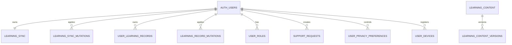

# Database schema

## 1. Scope and source of truth

Tài liệu này phản ánh [`supabase/schema.sql`](supabase/schema.sql) và migrations trong [`supabase/migrations/`](supabase/migrations/). Supabase Auth schema do Supabase quản lý. Không chạy SQL bằng cách sao chép ngẫu nhiên từ tài liệu; migrations trong repository là nguồn triển khai.

## 2. Core data model



### `auth.users` — physical, Supabase-managed

| Item | Description |
|---|---|
| Purpose | Cloud identity for email/password, OAuth, passwordless and MFA providers configured in Supabase. |
| Key | `id uuid`; referenced by user-owned public tables. |
| Application access | Through Supabase Auth client, not direct table queries from the browser. |
| Security | Managed by Supabase; service-role credentials must remain server-side. |

There is no custom `public.users` table in the core schema.

### `public.learning_sync` — physical core table

| Field | Type | Purpose |
|---|---|---|
| `user_id` | `uuid primary key` | One row per `auth.users.id`; cascade delete. |
| `payload` | `jsonb not null` | Bounded snapshot containing user/profile/learning domains. |
| `schema_version` | `integer` | Snapshot schema compatibility. |
| `revision` | `bigint` | Optimistic concurrency token. |
| `updated_at` | `timestamptz` | Last cloud update time. |

Security:

- RLS enabled.
- Select policy: `auth.uid() = user_id`.
- Direct insert/update/delete revoked from `anon` and `authenticated`.
- Writes use `public.compare_and_swap_learning_sync(...)`, granted only to `authenticated`.

### `public.learning_sync_mutations` — physical support table

Tracks applied mutation IDs for idempotency. Direct access is revoked. The compare-and-swap function reads/writes it using a security-definer boundary and records `user_id`, `mutation_id`, `applied_at`.

### `public.user_learning_records` — physical record-sync table

This table is the primary multi-device write path introduced by `20260922_learning_record_sync.sql`. Its composite key is `(user_id, domain, record_id)`; each row has a monotonic `version`, device ID, client/server timestamps, JSON payload and optional tombstone. Profile, lesson progress, activity days, SRS cards, favorites, error-notebook entries, quiz attempts, achievements and sessions therefore merge independently instead of overwriting an entire account snapshot.

Authenticated clients may only select rows where `auth.uid() = user_id`. Direct insert/update/delete is revoked. `apply_learning_record_batch(...)` validates identity from Auth, takes per-record transaction locks, checks every expected version before writing, and records an idempotency mutation. A conflict returns current server records and applies none of the batch.

`learning_sync` remains during rollout as an atomic compatibility snapshot and off-device fallback. The client backs up all local domains before its first record migration, pulls and merges first, then pushes record batches, and finally refreshes the legacy snapshot CAS.

## 3. Logical learning domains

The task vocabulary “profile, progress, SRS, errors” refers to logical domains, not separate physical tables. They are represented as independent rows in the shared `user_learning_records` table; the legacy snapshot also retains them for rollout compatibility.

| Logical domain | Local source | Cloud representation | Main fields |
|---|---|---|---|
| User/profile | `klearn_users`, `klearn_learner_profile` | `__profile/profile`, profile-domain records, plus legacy snapshot | level, goals, learning track/mode, preferences, weak/strong skills |
| Progress | `klearn_progress` | summary, `lesson:<id>` and `activity:<date>` records | lesson progress, stats, skills, daily tasks, activity-day evidence |
| SRS | `klearn_srs` | one `klearn_srs/<wordId>` record per card | status, counts, mastery, interval, last/next review |
| Favorites/errors/history | corresponding local keys | one record per stable item ID | favorites, mistake evidence, quiz attempts, achievements and sessions |

Each local object is scoped by the local learner ID. When a cloud account is linked, snapshot creation extracts only the current user’s values and applies per-domain size limits.

### Why this model exists

- Keeps the app functional before Supabase is configured.
- Allows one atomic, revisioned snapshot for the existing learning model.
- Avoids a destructive migration of many established localStorage domains.

### Trade-offs

- SQL cannot efficiently query every nested learning item.
- Payload growth must be bounded and monitored.
- Analytics requiring cohorts should use normalized/aggregate tables rather than reading private snapshots.

## 4. Content and quality tables

Key normalized tables:

- `learning_content`: lessons/vocabulary/grammar/audio/quiz/exercise records and workflow metadata.
- `learning_content_versions`: immutable before/after snapshots created by governance triggers/workflow.
- `content_reviews`, `content_reports`: human review and issue reporting.
- `content_quality_reviews`, `content_quality_reports`: scoring and quality workflow.
- `ai_content_drafts`: generated draft metadata; publication still requires authorized human approval.

P62 migrations restrict learners to approved/active learning content while content roles can work with drafts and review records.

## 5. Education and support tables

This group supports foundations for human review and organizations:

- Identity/roles: `user_roles`.
- Mentor support: `support_requests`, `support_responses`.
- Teacher relationships: `teacher_student_links`, `teacher_assignments`, `teacher_feedback`.
- Organizations/courses: `education_organizations`, `education_organization_members`, `education_classes`, `education_class_students`, `education_courses`, `education_course_items`, `education_class_assignments`.

These tables do not prove that a school product is operational. They provide schema/RLS foundations used by the current UI where configured.

## 6. Privacy, telemetry and operations

- Privacy: `user_privacy_preferences`, `user_devices`, `privacy_deletion_requests`, `security_audit_logs`.
- Production telemetry: `production_error_events`, `production_performance_metrics`, `production_health_checks`.
- Research consent/events: `research_consents`, `learning_research_events`, `research_feedback`, `research_experiment_logs`.
- Learning outcomes/analytics: `learning_analytics_reports`, related outcome migrations and aggregate metrics.

User-owned tables use owner policies; admin views use role checks. Aggregate tables should not expose row-level private journals or learning content to unrelated users.

## 7. Extension/foundation groups

Additional migrations create tables for community, premium/commercial, marketplace, global language, AI audit, mobile notifications, career, learning science, growth and immersive scenarios. Treat them as bounded feature foundations. For a complete physical inventory, run:

```powershell
rg -o "create table if not exists public\.[a-zA-Z0-9_]+" supabase/schema.sql supabase/migrations | Sort-Object -Unique
```

## 8. RLS rules

Required pattern for new user-owned tables:

1. Reference `auth.users(id)` where applicable.
2. Enable RLS before granting browser access.
3. Owner policy uses `auth.uid() = user_id`.
4. Organization access checks active membership and role.
5. Admin/reviewer policies use database role helpers, not a client-provided role string.
6. Never expose service-role keys to browser or PWA assets.

## 9. Sync consistency

`compare_and_swap_learning_sync` receives:

- `p_expected_revision bigint`
- `p_payload jsonb`
- `p_schema_version integer`
- `p_mutation_id text`

The function locks/compares the current revision, returns conflict information when stale, ignores already-applied mutation IDs and increments the revision for accepted updates. Client code pulls and merges before retrying a conflict.

For normalized records, `apply_learning_record_batch` accepts at most 200 records. Every item includes `domain`, `recordId`, `payload`, `expectedVersion`, `clientUpdatedAt` and optional `deletedAt`. The server derives `user_id` exclusively from `auth.uid()` and the device cannot select or mutate another user's rows. Activity-day records are unioned by date and mutation ID, so two devices studying on the same day contribute one learning day rather than inflating the streak.

## 10. Backup and deletion

- Supabase backup/PITR is an owner-side operational configuration, not created by frontend code.
- Daily recovery snapshots cover selected high-value domains. The pre-record-sync migration backup and user-exported JSON cover every synchronized local domain and are kept without deleting local data.
- Account deletion is a request workflow; destructive execution must happen in a trusted backend/admin process.
- Follow [`docs/production/BACKUP_RESTORE.md`](docs/production/BACKUP_RESTORE.md) and test restore separately from backup creation.
