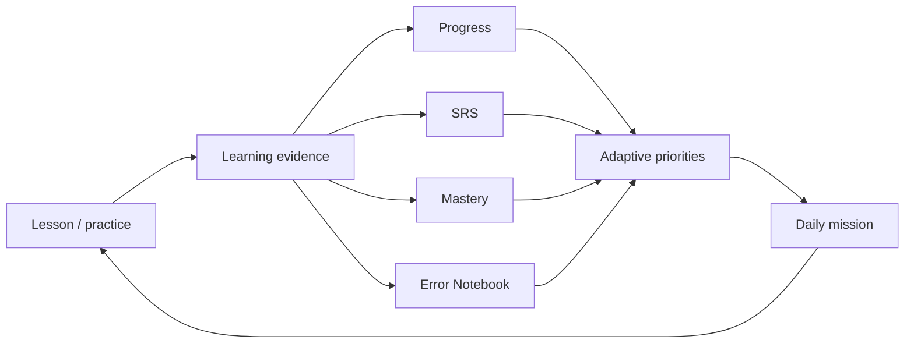

# Learning engine

## 1. Overview

TamHoanq’s learning engine is a set of deterministic client-side services backed by user-scoped learning data. AI may explain a recommendation but does not control core SRS intervals, mastery evidence or daily task completion.



## 2. SRS

### States

| Stored/effective state | Meaning |
|---|---|
| `not_started` | No learning evidence; card is not silently due. |
| `learning` | Activated but not stable. |
| `review` | Previously remembered and scheduled. |
| `due` | Effective state when an active card’s `nextReview` is in the past. |
| `mastered` | Strong evidence/mastery threshold reached. |

New vocabulary is initialized as `not_started` with no `nextReview`. Completing a lesson/first-word activity can create learning evidence and activate related cards.

### Base review intervals

The flashcard rating flow in `app.js` currently uses:

| Rating | Next interval | Mastery change |
|---|---|---|
| `forgot` | 10 minutes | −18 |
| `hard` | 1 day | +4 |
| `remember` | 3 days; 14 after 3 correct streak; 30 after 5 | +10 |
| `easy` | 7 days; 14 after 3 correct streak; 30 after 5 | +15 |

Mastery is clamped 0–100. A card becomes `mastered` when mastery is at least 85 and correct streak is at least 3; otherwise remembered cards stay in `review`.

### Learning-science extension

`data/learning-science-engine.js` can adjust interval using correctness, confidence, previous interval, risk and mistake signals. It records counts, confidence, last result and next interval. This extension augments the base SRS; it does not rewrite historical evidence.

### Due calculation

A card is due only when it has learning evidence, its stored status is `learning` or `review`, and `nextReview <= now`. `mastered` cards are not automatically classified as due by the base state service; risk-based review may still recommend stale knowledge through advanced review logic.

## 3. Mastery

### States

The app uses mastery labels including:

- `not_started`
- `learning`
- `understood`
- `mastered`

Vocabulary also carries numeric `mastery` 0–100. Lesson completion writes a lesson score/mastery score from actual check/completion evidence. UI labels must not imply official proficiency.

### Evidence

Mastery can use:

- correct/wrong/review counts;
- correct streak;
- lesson completion/check score;
- practice attempts and skill breakdown;
- checkpoint result;
- error recurrence/resolution.

No content should become mastered merely because it exists in the catalog or was displayed.

## 4. Adaptive learning

`AdaptiveLearningEngine` builds a sorted priority list from existing learner data. Documented rule signals include:

- weak skill;
- repeated/frequent error;
- overdue SRS;
- time since last practice;
- target TOPIK relevance;
- weak knowledge-graph relation;
- current goal/deadline.

Daily mission generation is deterministic for the same learner/date/data. Missions are stored by date so a reload does not randomly replace the plan.

The engine chooses from existing routes/content. It does not generate curriculum or guarantee the fastest possible path.

## 5. Error Notebook

Errors are captured from practice, exam, listening dictation, speaking text comparison, writing checks, sentence building and checkpoints where the relevant module is active.

Typical record:

```json
{
  "type": "grammar",
  "question": "...",
  "mistake": "...",
  "correction": "...",
  "explanation": "...",
  "count": 2,
  "resolved": false
}
```

The service groups/repeats evidence rather than creating a new unrelated error for every occurrence. Repair paths can move through identify → review → practice → retest → resolved. Repeated mistakes may reopen a path.

## 6. Daily mission and one-click study

Daily planning combines due review, current lesson, weak skills/errors and available time. Time modes (for example 5/15/30/60 minutes) choose a bounded set of activities; they do not require AI.

Completion updates the relevant learning domain and schedules CloudSync. A plan is guidance, not a hard lock: users can open other routes.

## 7. Learning outcomes

Outcome reports distinguish measured and unavailable data. Skill growth requires baseline and later evidence. Missing evidence must render as unavailable/pending, not zero improvement. This guardrail is covered by P52/P48 regression tests.

## 8. Data persistence

- Local writes happen first.
- User-scoped data is stored in `klearn_*` domains.
- CloudSync schedules a bounded snapshot when a linked account and network are available.
- Background mutation IDs provide idempotency support.
- Recovery checkpoint/backup protects current session and core domains.

## 9. Invariants

1. New cards are not due without learning evidence.
2. Completing an action is idempotent where a mutation ID exists.
3. Cloud conflict does not silently overwrite a newer revision.
4. Missing measurements are not converted to success/failure scores.
5. AI failure cannot block core lessons, dictionary, SRS or local progress.
6. User data is never reset during additive schema migration.

## 10. Verification

Relevant tests:

- `tests/p48-learning-integrity.test.js`
- `tests/p48-learning-integrity.browser.js`
- `tests/daily-learning-experience.test.js`
- `tests/learning-science-engine.test.js`
- `tests/learning-outcomes.test.js`
- `tests/p47-safety-data-integrity.test.js`

Run all static/contract tests as described in [`DEVELOPMENT_GUIDE.md`](DEVELOPMENT_GUIDE.md).
