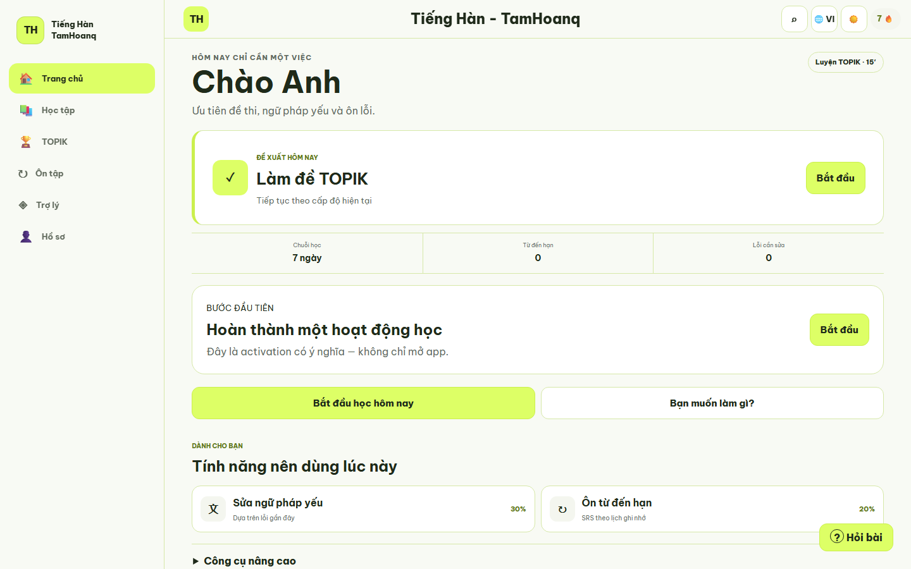
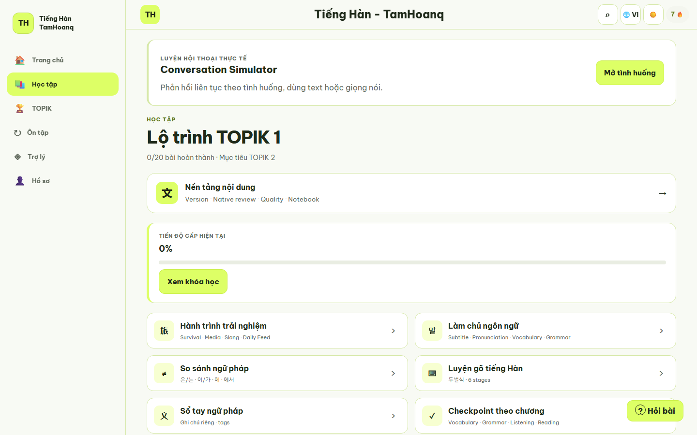
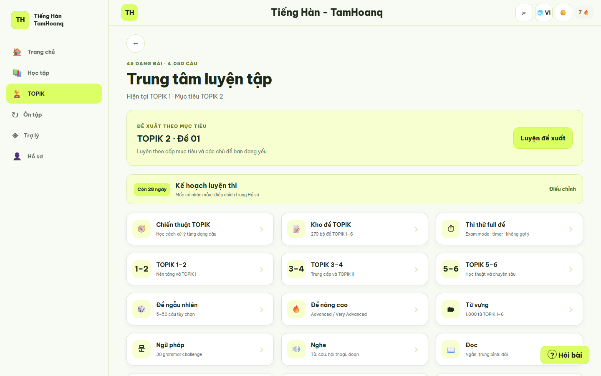
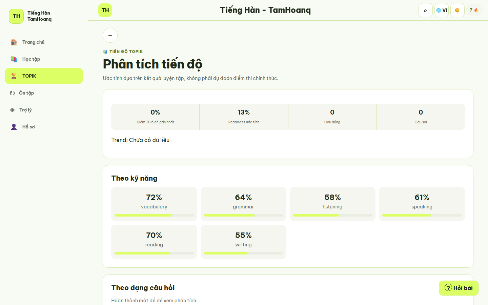
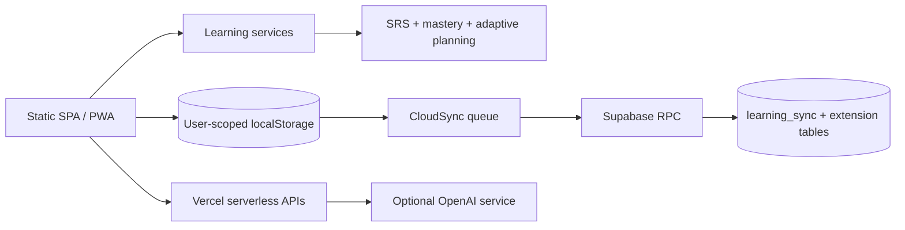

<div align="center">
  
  <h1>Tiếng Hàn - TamHoanq</h1>
  <p><strong>Mỗi ngày một bước tiến gần hơn tới tiếng Hàn thực tế.</strong></p>
  <p>Ứng dụng học tiếng Hàn mobile-first cho người Việt, từ Hangul đến TOPIK, giao tiếp và mục tiêu nghề nghiệp.</p>
</div>

> Status: `v1.2.0-rc.1` · release candidate. The product is actively validated and is not presented as production-ready.

## Product

Tiếng Hàn - TamHoanq turns a large learning toolkit into a clear daily journey. A learner can start from Level 0, continue with TOPIK, practise real-life situations, review with spaced repetition, and inspect evidence of progress without moving between disconnected tools.

The current repository contains:

- a dependency-light static SPA/PWA;
- browser-local learning with optional Supabase authentication and cloud synchronization;
- deterministic SRS, mastery, adaptive planning, and analytics engines;
- optional AI assistance behind explicit privacy consent and graceful fallbacks;
- a Capacitor mobile shell for Android and iOS validation;
- serverless APIs and migration foundations for later platform growth.

See [Project overview](PROJECT_OVERVIEW.md) for scope, audiences, capabilities, and current limitations.

## Screenshots

| Daily learning home | Learning path |
| --- | --- |
|  |  |

| TOPIK workspace | Personal analytics |
| --- | --- |
|  |  |

The complete, reproducible set covers Landing, Home, Learning, Grammar, TOPIK, Assistant, Analytics, and Profile. Capture instructions and privacy rules are in [Portfolio screenshots](docs/screenshots/README.md).

## Features

### Learn from zero

- Level 0 onboarding for learners who do not know Hangul yet.
- Hangul Academy, syllable building, batchim foundations, first words, and first sentence.
- Guided checkpoint before TOPIK 1 without a hard lock.

### Build durable knowledge

- Active recall and spaced repetition with difficulty, confidence, error history, and memory risk.
- Evidence-based mastery and an error notebook with focused repair paths.
- Daily plans sized to available time, recovery plans, and manual review queues.

### Use Korean in context

- Reading, listening, dictation, pronunciation, writing, and conversation practice.
- Culture notes, formality guidance, natural expressions, collocations, and real-life scenarios.
- TOPIK preparation, career Korean, and immersive mission foundations.

### Understand progress

- Personal skill growth, retention, knowledge health, learning outcomes, and goal milestones.
- Learner-first comparisons against past performance, not public leaderboards.
- Teacher, content, organization, and operations foundations protected by role-aware interfaces.

### Work online or offline

- Installable PWA with a scoped cache strategy.
- Local-first progress and background synchronization when cloud services are configured.
- Downloadable learning packs and a Capacitor mobile shell for native validation.

## Architecture



The application shell is loaded by `index.html` and `app.js`. Route-specific modules are lazy-loaded by `data/route-loader.js`; user-scoped state remains available locally and can be synchronized through a compare-and-swap Supabase RPC. AI requests go through a separate serverless boundary and are optional.

Read the detailed documents:

- [System architecture](SYSTEM_ARCHITECTURE.md)
- [Database schema](DATABASE_SCHEMA.md)
- [API documentation](API_DOCUMENTATION.md)
- [AI architecture](AI_ARCHITECTURE.md)
- [Learning engine](LEARNING_ENGINE.md)
- [Security policy](SECURITY.md)

## Technology

| Area | Technology |
| --- | --- |
| Web | Semantic HTML, modular CSS, browser JavaScript |
| PWA | Web App Manifest, Service Worker, Cache Storage |
| Cloud data | Supabase Auth, PostgreSQL, RLS, RPC |
| Edge APIs | Vercel serverless functions on Node.js |
| Optional AI | OpenAI Responses API through `/api/chat` |
| Mobile shell | Capacitor 8, Android and iOS projects |
| Validation | Node.js contract tests, headless Edge browser QA, GitHub Actions |

The web client deliberately has no root bundler or runtime package dependency. The native shell has its own dependencies in `mobile/package.json`.

## Installation

### Prerequisites

- Python 3 for a zero-configuration static server, or another HTTP server.
- Node.js 22 for validation scripts and serverless/mobile tooling.
- Microsoft Edge for real-browser QA and screenshot capture.

### Run the web application locally

```bash
git clone https://github.com/tam9166/Hoctienghan.git
cd Hoctienghan
python -m http.server 4173 --bind 127.0.0.1
```

Open `http://127.0.0.1:4173/`. A static server supports local learning and most UI flows. Requests under `/api/*` return `404` unless a serverless development runtime is used.

### Configure optional services

Copy `.env.example` to the environment file used by your hosting/development runtime and provide only the values you need. Important groups are:

- `SUPABASE_URL` and `SUPABASE_ANON_KEY` for cloud authentication and sync;
- `OPENAI_API_KEY` plus optional model variables for AI assistance;
- `APP_ALLOWED_ORIGINS` and mobile origins for CORS;
- `PRODUCTION_URL` for production smoke monitoring.

Never expose a Supabase service-role key or an OpenAI API key in browser code. `/api/config` returns only validated public Supabase configuration.

For serverless and mobile setup, follow [Development guide](DEVELOPMENT_GUIDE.md) and [Mobile native ecosystem](docs/mobile-native-ecosystem.md).

### Validate a change

PowerShell:

```powershell
Get-ChildItem api,data,scripts,tests -Recurse -Filter *.js | ForEach-Object { node --check $_.FullName }
node scripts/verify-production-build.js
node scripts/release-readiness.js
Get-ChildItem tests -Filter *.test.js | ForEach-Object { node $_.FullName }
```

The CI workflow repeats syntax, build-contract, release-readiness, and static contract checks on `main` pushes and pull requests.

## Demo

The canonical presentation path is:

```text
Landing → Sign in → Personalized Home → Learning → Review
        → Optional Assistant → Analytics → Profile
```

Use synthetic data or an isolated demo account. Do not demo with a real learner's history. Prepared 5-, 10-, and 20-minute scripts, failure fallbacks, and an architecture explanation are available in [Demo guide](DEMO_GUIDE.md).

## Documentation

| Document | Purpose |
| --- | --- |
| [Project overview](PROJECT_OVERVIEW.md) | Product scope, users, capabilities, and limitations |
| [System architecture](SYSTEM_ARCHITECTURE.md) | Runtime components, data flow, auth, sync, offline behavior |
| [Database schema](DATABASE_SCHEMA.md) | Physical Supabase schema and logical client domains |
| [API documentation](API_DOCUMENTATION.md) | Serverless endpoint contracts and examples |
| [AI architecture](AI_ARCHITECTURE.md) | Consent, routing, context, fallback, and quality boundaries |
| [Learning engine](LEARNING_ENGINE.md) | SRS, mastery, adaptation, evidence, and safeguards |
| [Security policy](SECURITY.md) | Threat boundaries, reporting, controls, and known gaps |
| [Development guide](DEVELOPMENT_GUIDE.md) | Local setup, validation, migrations, and deployment workflow |
| [Contributing](CONTRIBUTING.md) | Contribution and pull request expectations |
| [Changelog](CHANGELOG.md) | Release-level changes and known limitations |
| [Case study](CASE_STUDY.md) | Problem, decisions, outcomes, lessons, and future work |
| [Demo guide](DEMO_GUIDE.md) | Presentation scripts and safe demo preparation |

Operational runbooks and release evidence live under [`docs/`](docs/). They describe procedures and checks; their presence is not evidence that an environment is deployed or production-ready.

## Roadmap

Near-term priorities are intentionally narrower than the existing platform foundations:

1. validate the core learning journey with real users;
2. verify curriculum and examples with qualified Korean-language reviewers;
3. harden API authentication, distributed rate limiting, monitoring, and backup restore drills;
4. complete native device QA and store-signing workflows;
5. promote a release only after the documented launch gates pass.

See [Changelog](CHANGELOG.md) for the current release-candidate record.

## License

This repository does not currently declare an open-source license. Copyright remains with the repository owner; cloning or contributing does not grant redistribution or commercial-use rights. Add an explicit `LICENSE` file before publishing under a chosen license.

## Contact

- Project: [github.com/tam9166/Hoctienghan](https://github.com/tam9166/Hoctienghan)
- Product questions and non-sensitive bugs: [GitHub Issues](https://github.com/tam9166/Hoctienghan/issues)
- Security reports: follow the private reporting guidance in [SECURITY.md](SECURITY.md); do not post secrets or exploit details in a public issue.
