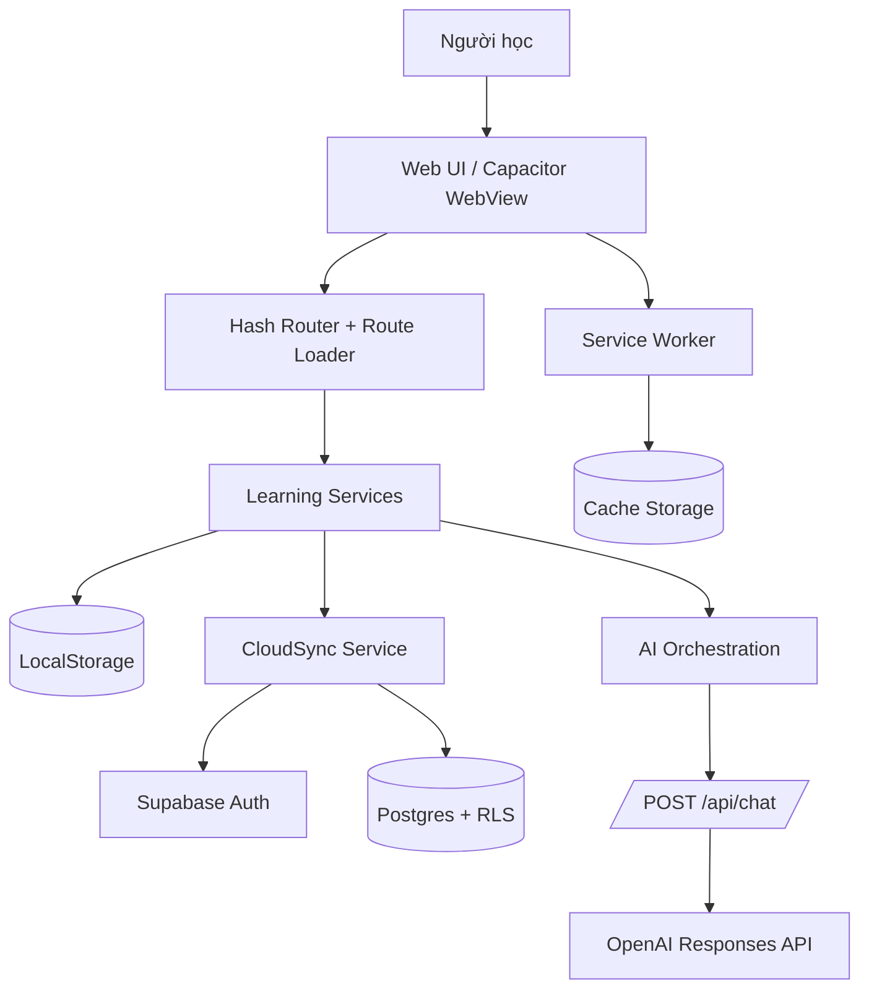
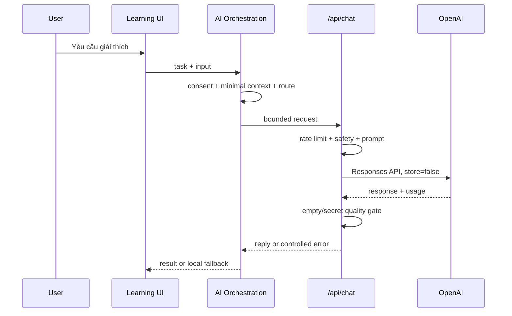
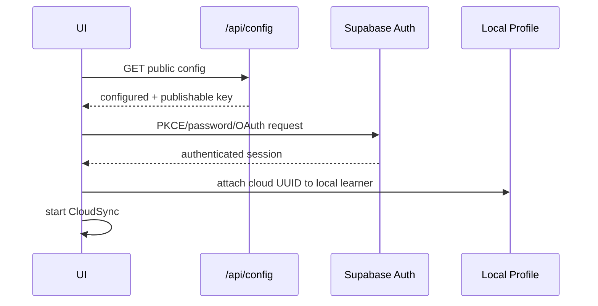
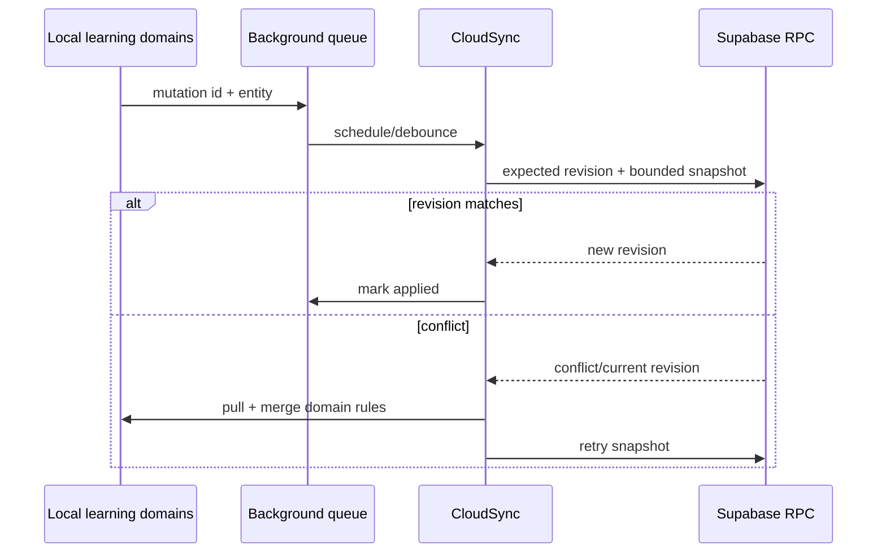

# System architecture

## 1. Architecture summary

TamHoanq là một **local-first static SPA/PWA**. Core UI và learning services chạy trong trình duyệt. Vercel phục vụ static assets và bốn serverless endpoints. Supabase cung cấp Auth/Postgres khi được cấu hình. AI đi qua endpoint server-side riêng; frontend không chứa provider key.

## 2. Frontend

### UI layer

- [`index.html`](index.html) chứa app shell, top bar, responsive navigation, PWA metadata và thứ tự core scripts.
- [`styles.css`](styles.css) chứa design tokens và phần lớn component styles; các module nâng cao có stylesheet riêng.
- Locale resources nằm trong [`locales/`](locales/). Nội dung học tiếng Hàn không được dịch tự động bởi locale layer.
- UI được render thành HTML từ `app.js` và các extension modules. Đây không phải React/Vue application.

### Routing

- Route là phần `location.hash`, ví dụ `#home`, `#lessons`, `#topik`.
- `app.js` giữ danh sách public/main views và điều phối render.
- [`data/route-loader.js`](data/route-loader.js) ánh xạ route sang nhóm CSS/JS và tải chúng theo nhu cầu.
- Category/discovery routes có thể render trước rồi tải extension; route chuyên biệt chờ dependencies cần thiết.

### State management

- Một object `state` trong `app.js` giữ view/session UI hiện tại.
- Domain services đọc/ghi qua wrapper `storage` và user-scoped helpers.
- Không có global state library. Mỗi module mở rộng đăng ký view/service qua các hook như `KLEARN_EXTRA_VIEWS` và `KLEARN_AFTER_RENDER`.
- Các mutation học quan trọng phát event `klearn-sync-action` để background queue/cloud sync xử lý.

### Storage

- `localStorage` giữ dữ liệu nhỏ, có cấu trúc và theo user: progress, SRS, settings, history, errors, profile.
- Cache Storage giữ app shell và offline packs; không dùng localStorage cho audio/blob lớn.
- Schema local hiện ở version `13`; migration theo hướng additive và có backup trước một số migration.
- Dữ liệu cloud dùng snapshot có giới hạn kích thước theo domain, không đồng bộ auth token vào payload học.

## 3. Learning layer

Learning layer không phải một class duy nhất. Nó là tập hợp service phối hợp:

- `SRSStateService` và `VocabularyService` quản lý trạng thái/interval thẻ.
- `MasteryService` suy ra mức độ bài/chủ đề từ evidence.
- `AdaptiveLearningEngine` xếp ưu tiên nhiệm vụ theo rule xác định.
- `ErrorNotebookService` gom lỗi thực hành và cung cấp context review.
- Các module practice, outcomes, analytics và learning science đọc cùng user-scoped domains.

Chi tiết thuật toán và giới hạn: [`LEARNING_ENGINE.md`](LEARNING_ENGINE.md).

## 4. Backend

### Runtime

Thư mục [`api/`](api/) chứa CommonJS handlers tương thích Vercel Serverless Functions:

- `GET /api/config`
- `POST /api/chat`
- `GET /api/health`
- `GET /api/version`

`vercel.json` đặt thời gian tối đa, security headers và no-store cho `/api/*`.

### Authentication

Có hai chế độ:

1. **Local account:** credential PBKDF2-SHA-256, salt ngẫu nhiên, session local có TTL 7 ngày. Chỉ phù hợp dữ liệu trên thiết bị.
2. **Cloud account:** Supabase Auth (`signUp`, password sign-in, PKCE). OAuth/passwordless/MFA có facade và chỉ hoạt động khi provider được cấu hình phía Supabase.

Supabase client lấy URL và publishable/anon key qua `/api/config`. Service-role key không được trả về frontend.

### AI endpoint

`/api/chat` yêu cầu consent header và body flag, giới hạn request/context, lọc chuỗi giống secret, route model small/strong và gọi OpenAI Responses API với `store: false`. Endpoint hiện không xác minh Supabase JWT; rate limiting theo IP/in-memory là lớp bảo vệ hiện có, không phải distributed quota.

## 5. Database

- Supabase quản lý identity trong `auth.users`.
- `public.learning_sync` là bảng core, một row mỗi cloud user.
- `payload` JSONB chứa logical learning domains; `revision` hỗ trợ compare-and-swap.
- `compare_and_swap_learning_sync` là RPC duy nhất được cấp cho authenticated users để ghi snapshot core.
- Migrations bổ sung bảng normalized cho content review, education, community, telemetry và các foundation khác.
- RLS được bật cho bảng user/organization data; policy thường dùng `auth.uid()` và helper role.

Chi tiết: [`DATABASE_SCHEMA.md`](DATABASE_SCHEMA.md).

## 6. AI layer

AI không được dùng làm source of truth cho curriculum, official TOPIK score, phoneme score hoặc handwriting recognition khi provider tương ứng không tồn tại.

## 7. Offline layer

- [`sw.js`](sw.js) precache app shell/core learning assets và cache optional route assets khi dùng.
- Offline packs có namespace cache riêng (`klearn-pack-*`).
- Background sync queue lưu mutation nhỏ khi offline và retry khi online.
- Recovery checkpoint/backup local bảo vệ current session, progress, SRS, profile và settings.
- Private API responses và user data không được đưa vào public cache strategy.

## 8. Data flows

### Authentication flow

Nếu config không hợp lệ hoặc mất mạng, local learning vẫn hoạt động.

### Sync flow

## 9. Deployment architecture

- Push/PR to `main` chạy CI syntax, build contract, launch-readiness và static tests.
- Production deployment chạy khi tạo tag `v*` hoặc workflow dispatch.
- Tag phải khớp version trong `version.json`.
- Vercel build/deploy cần repository secrets; smoke test chạy trên deployment URL và canonical URL nếu có.
- Production monitor chạy mỗi 30 phút khi `PRODUCTION_URL` được cấu hình.

Runbooks: [`docs/production/README.md`](docs/production/README.md).

## 10. Known constraints

- Root web app không có bundler/package.json; “build contract” là kiểm tra asset graph, không transpile bundle.
- Rate limiter serverless là in-memory theo instance, không phải distributed rate limit.
- Local account không đồng bộ giữa thiết bị cho tới khi liên kết cloud.
- Một số product areas là foundation/demo, chưa có external operation hoàn chỉnh.
- Automated checks không thay thế accessibility audit thủ công, load test, security assessment hoặc user outcome study.
